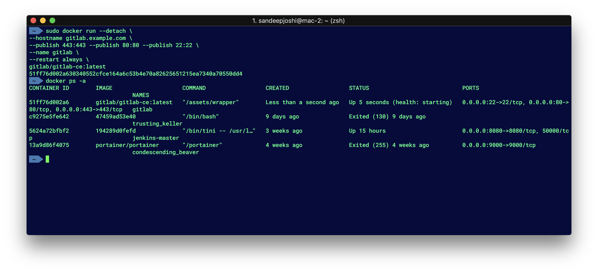
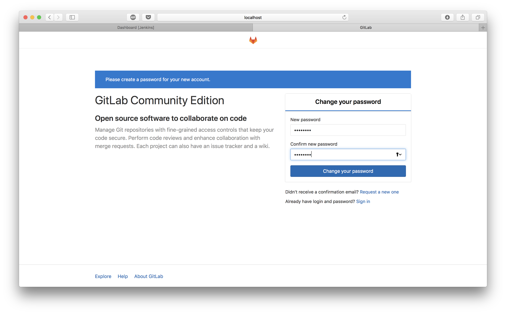
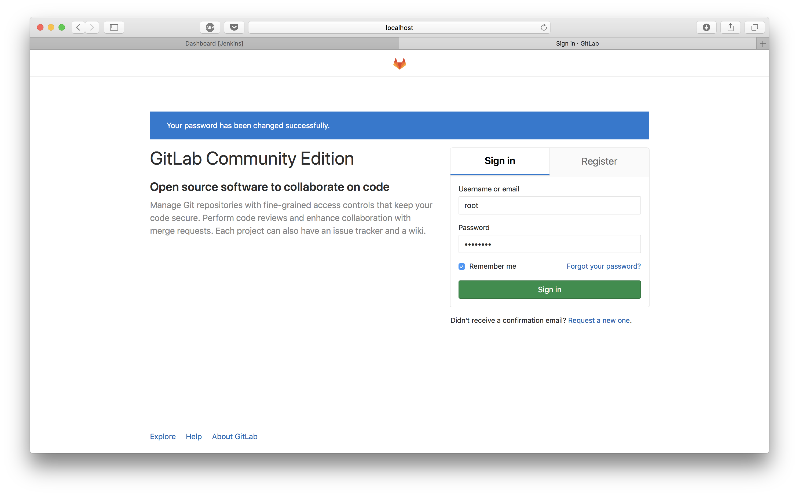
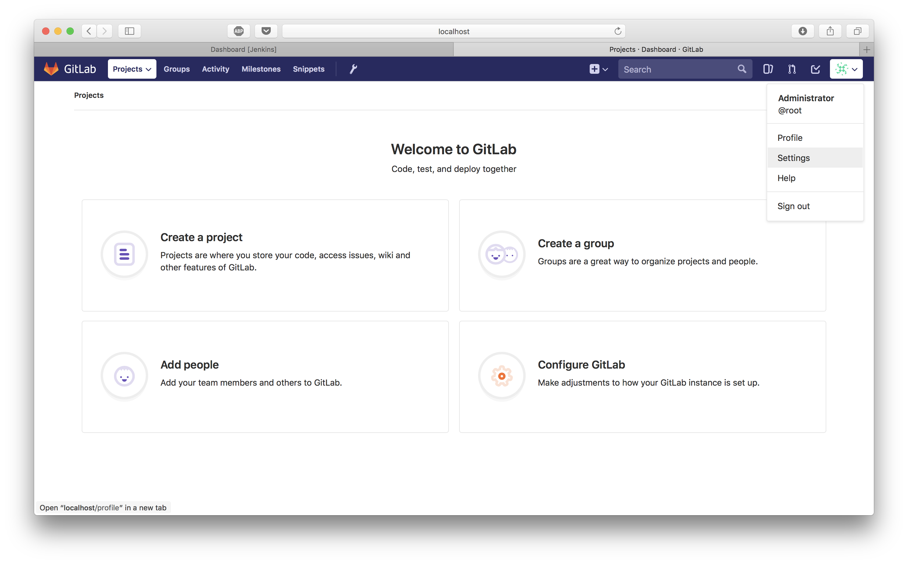
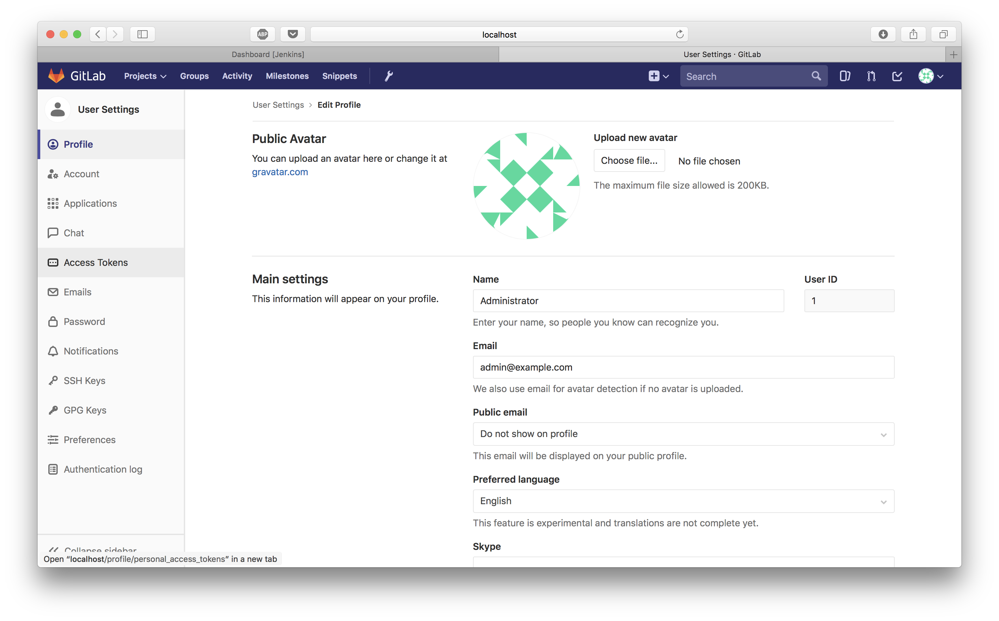
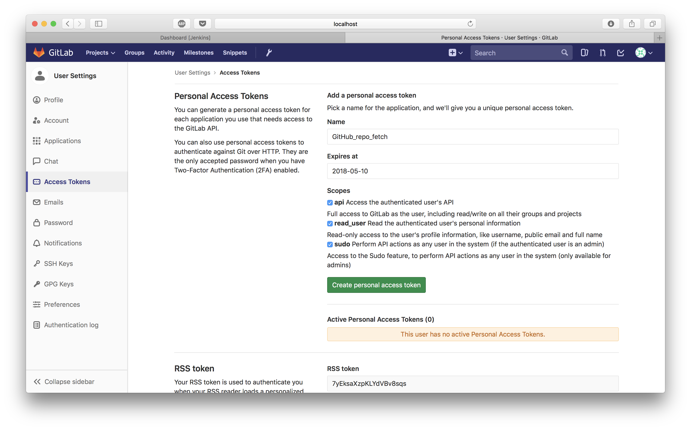
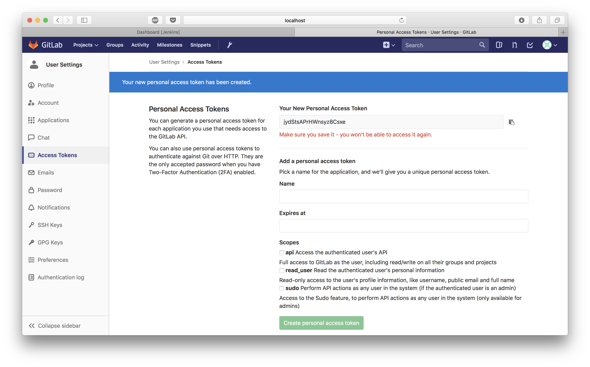
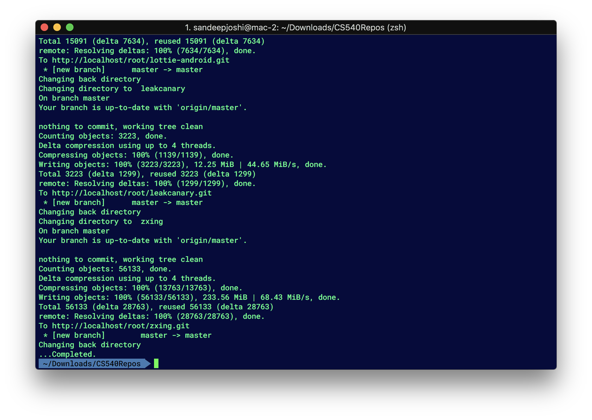
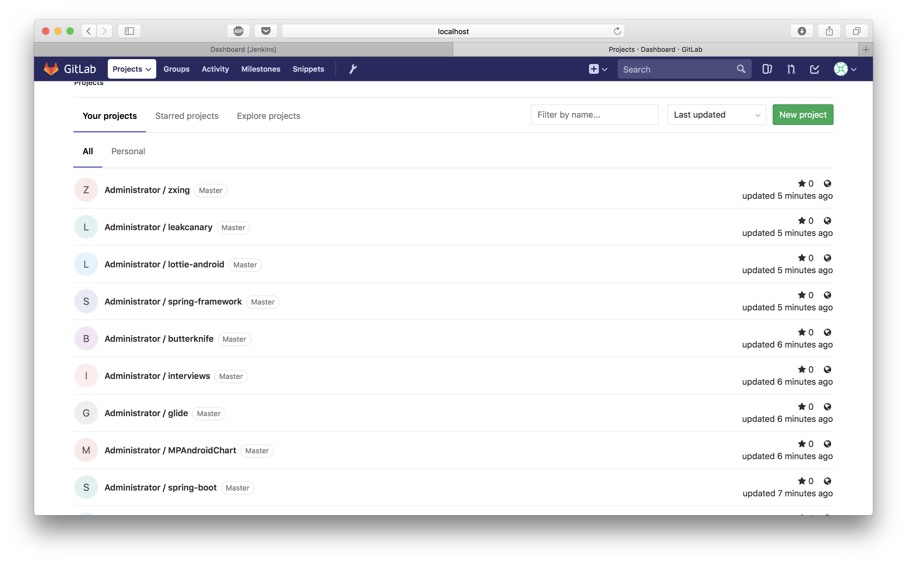

# GitLab Setup

## Installing GitLab using the docker image

Run the following command to install gitlab. Once installed, we can see gitlab container running.

```
sudo docker run --detach \
--hostname gitlab.example.com \
--publish 443:443 --publish 80:80 --publish 22:22 \
--name gitlab \
--restart always \
gitlab/gitlab-ce:latest
```



Now go to `https://localhost:80/` to find gitlab up and running. If its not available yet, wait for few minutes till you can see gitlab up and healty. You can find this info by running the command `docker ps -a`


Setup a new password and this will be the password for the user `root` which is by default an admin user. You can create more users as required. Once the password is setup, you can login to gitlab as shown below.





Now navigate to user's settings. 





Navigate to Access Tokens to proceed to generate an access token. Give it a name and expiry date.



Once the token is generated, keep it in a secure place. We'll use this token to auto-populate the projects in gitlab server.




We'll now run `fetch_repo.py` to pull projects of a specified language from github and push them to gitlab.

```
python3 fetch_repos.py [github_username] [github_password]
```
Running this command with valid github credentials will then prompt to provide the personal access token which we obtained earlier. Upon entering the token, projects are set up in gitlab.



We can now check gitlab whether all the repos have been set up.

