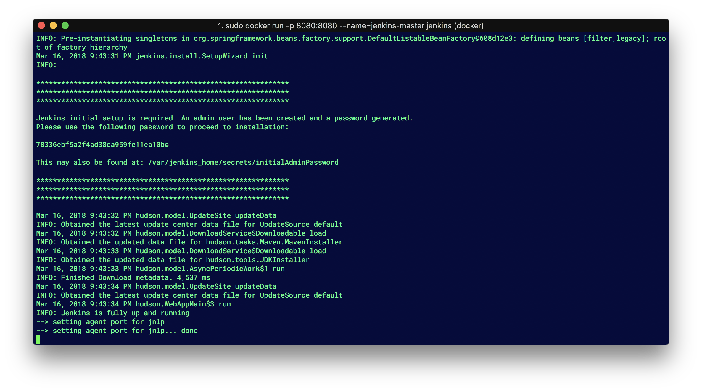
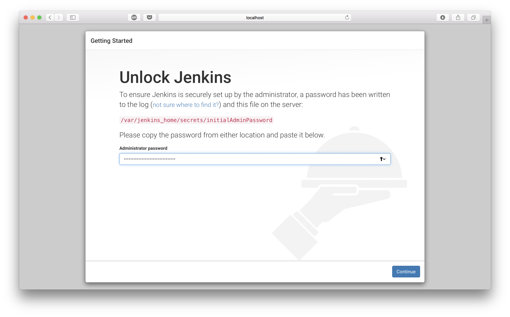
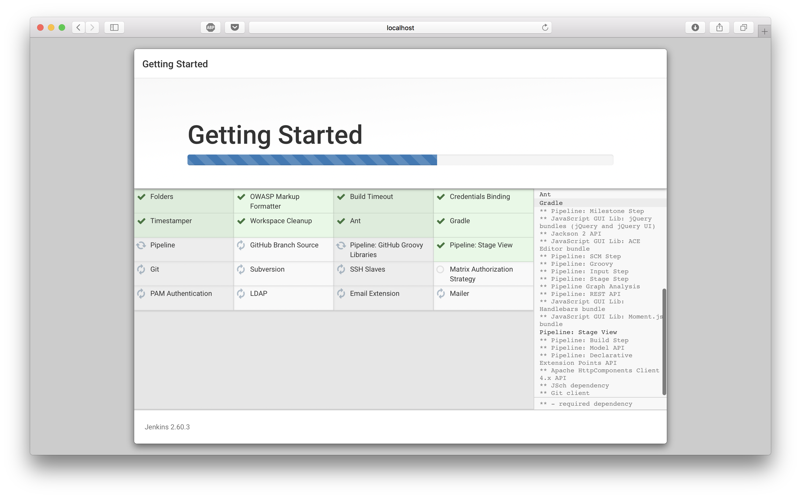
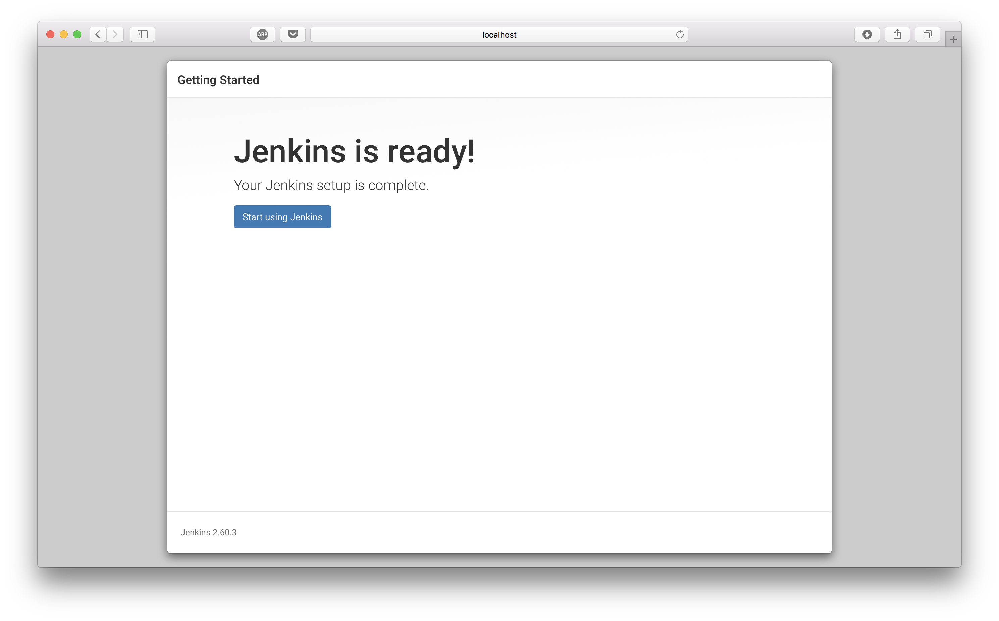
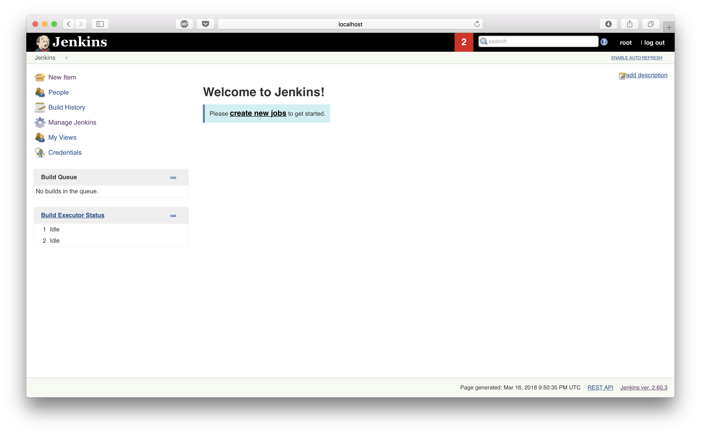
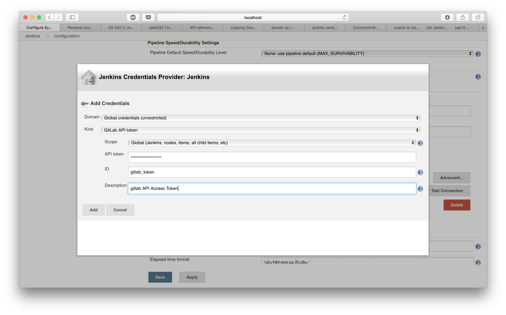
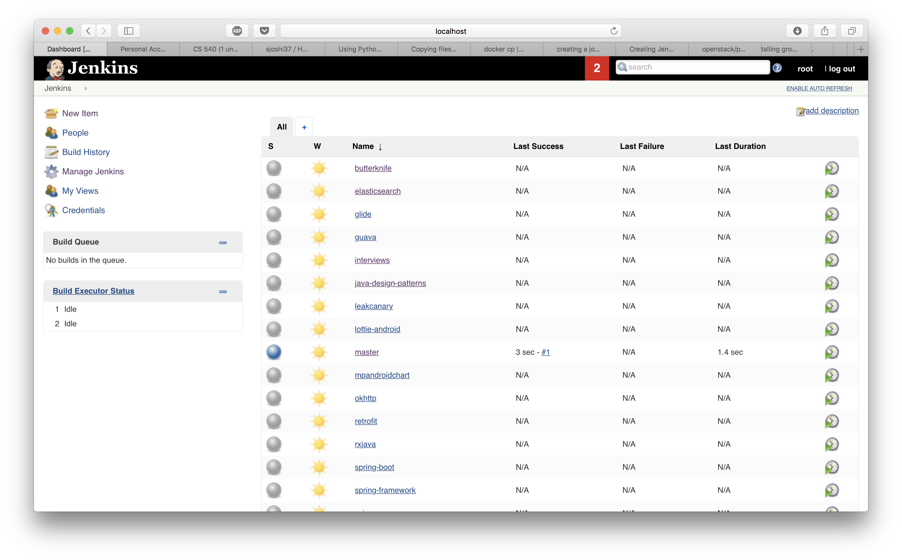

# Jenkins - Setup

## Install Jenkins

``` zsh
sudo docker pull jenkins
```

``` bash
sudo docker run -p 8080:8080 --name=jenkins-master jenkins
```

Once the jenkins container is running, we need to do a one time setup. As you can see in the terminal, copy the password printed or alternatively the password is always available at : ``` /var/jenkins_home/secrets/initialAdminPassword```



For this, first login into the container by running the command,

``` sudo docker exec -i -t jenkins-master(name_of_the_image) /bin/bash```

Then navigate to the above path and copy the `initialAdminPassword` to the clipboard

• Now goto `http://localhost:8080/` to find the jenkins up and running as in Fig 1.2


Now Paste the `initialAdminPassword` in the clipboard in the jenkins webpage as in Fig 1.3

Click continue. Now jenkins gives options for a custom/suggested installation as in Fig 1.4. We select suggested installation.


This will install the standard components as in Fig 1.5



Once the installation is done, jenkins brings you to create first user. Create an user as shown in Fig 1.6


Once the user is created, click complete and jenkins in now ready to use! Fig 1.7


A fresh view of jenkins should look like Fig 1.8



We now need to setup plugins in jenkins. Run the install_plugins script - `python3 install_plugins.py`<br/>
If the output is `True`, run the command `docker restart jenkins-master` to restart jenkins


### Now we need to configure the gitlab plugin.

Go to `Manage Jenkins` > `Configure System`. Here gitlab section is not configured and should look like this one below


We need to give some details:<br/>
• Connection name : A name for gitlab connection which we'll later refer in each of the job created as well as job DSL. This connection is global for jenkins. We'll give ```gitlab``` as the name.

• Gitlab host url: This is the url of the gitlab container running in the system. We enter `http://172.17.0.2:80/`

• Credentials : We don't have any gitlab credentials setup as of now. We'll create a new one as below. Click on the `Add` button to setup a new credential. Enter the gitlab personal access token generated before. Jenkins will use this credential for various purposes like fetching the repos for jobs</br>



Once this is setup, click on test connection. This should return `success` as shown below.


> If you are getting any error, check the url of gitlab. It should not be localhost. Since we are running gitlab and jenkins through docker, jenkins and gitlab are running in the lan of docker. jenkins needs to refer to gitlab within that network. So, to get the address of gitlab, in bash of gitlab, find the url at `/etc/hosts` file. Enter that url here.

## Job Creation

We need to create jobs for each of the repos setup in gitlab. For this we'll use job DSL plugin to do it. Job DSL is written in groovy to fetch all the projects in gitlab and setup a job for each of the repo setup in gitlab. Below is the code for job DSL

``` groovy

    String private_token = "sc24K_e5avo6QjiF7G7c"
    String ip = "http://172.17.0.2:80/"
		def jdata = new groovy.json.JsonSlurper().parseText(new URL("http://172.17.0.2:80/api/v3/projects?private_token="+private_token).text)
		jdata.each {
			String repo_url = it.ssh_url_to_repo
          	repo_url = repo_url.replace("git@gitlab.example.com:",ip)
            String proj =  repo_url.substring(repo_url.lastIndexOf('/') + 1);
			String project_name =  proj[0..-5]
            job(project_name) {
  
                description('A job for the project: ' + project_name)
                displayName(project_name)

                scm {
                    git {
                    branch('master')
                    remote { 
                        url(repo_url)
                        credentials('gitlab-root-user')
                    }
                    }
                }
  
                steps {
                    gradle('check')
                    gradle {
                    tasks('clean')
                    tasks('build')
                    switches('--stacktrace')
                    switches('--debug')
                
                    }
                    
                }
                
                publishers {
                    jacocoCodeCoverage {
                        execPattern '**/**.exec'
                        classPattern '**/classes'
                        sourcePattern '**/src/main/java'
                        exclusionPattern ''
                        inclusionPattern ''
                    }
                
                }
                
                triggers {
                        gitlabPush {
                            buildOnMergeRequestEvents(true)
                            buildOnPushEvents(true)
                        }
                    }
  
                authenticationToken('auhgtbereb675nksnwewrhbbe==')
  
            }
		}
```
We use this code as part of the script in a master job xml. We again use python jenkins to create a master job and then build the created job. This job will inturn create a job for each of the repo in gitlab. It is important to verify the url and replace the `private_token` with the one we got in gitlab.</br>

We need to now run the create_master_job script which will accomplish all of this. Open terminal and run the command `python3 create_master_job.py` </br>

This has now created a job for each of the repo present in the gitlab as shown below




